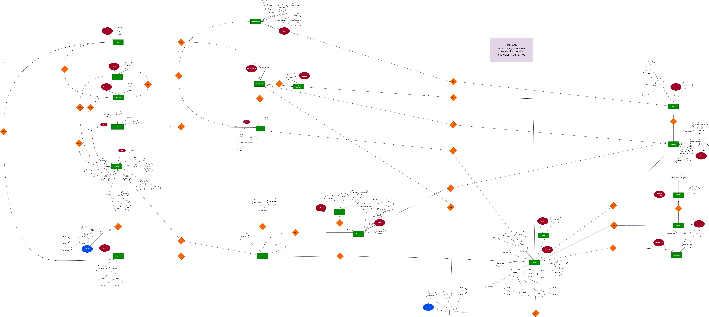

<div align="center">

# 🏥 Hospital Management System Database

### A normalized PostgreSQL database project designed from an ERD and implemented with tables, relationships, views, functions, procedures, indexes, seed data, security foundation, and validation queries.


</div>

---

## 📌 Executive Summary

This repository contains a complete **Hospital Management System relational database** designed from an Entity-Relationship Diagram and implemented in **PostgreSQL**.

The system models the main hospital business areas: **departments, employees, clinics, patients, appointments, visits, diagnoses, surgeries, medicines, prescriptions, billing, payments, products, vendors, stores, inventory, facilities, roles, and access permissions**.

From a Senior DBA perspective, the project focuses on:

- Clean relational schema design
- Normalization and reduced redundancy
- Primary key and foreign key enforcement
- Many-to-many relationship resolution
- Data integrity constraints
- Seed data for testing
- Views for reporting
- Functions for reusable calculations
- Stored procedures for controlled workflows
- Indexes for performance optimization
- Validation queries for ERD correctness
- Security/access-control foundation

---

## 🧭 ERD Diagram

> The ERD below is the source design used to build the relational database schema.

<p align="center">
  
</p>

### ERD Legend

| Visual Element | Meaning |
|---|---|
| 🟩 Green rectangle | Entity |
| 🔴 Red ellipse | Primary key |
| 🔵 Blue ellipse | Partial key |
| ⚪ White ellipse | Attribute |
| 🟧 Orange diamond | Relationship |

---

## 🧱 Project Architecture

```text
Hospital Management System Database
│
├── Core Administration
│   ├── Departments
│   ├── Specialization Categories
│   ├── Specializations
│   ├── Jobs
│   └── Roles
│
├── Human Resources
│   ├── Employees
│   ├── Shifts
│   ├── Employee Shifts
│   └── Role Access
│
├── Clinical Operations
│   ├── Clinics
│   ├── Clinic Employees
│   ├── Patients
│   ├── Patient Phones
│   ├── Appointments
│   └── Visits
│
├── Medical Records
│   ├── Diagnosis Categories
│   ├── Diagnoses
│   ├── Patient Diagnoses
│   ├── Surgeries
│   ├── Patient Surgeries
│   ├── Medicines
│   └── Prescriptions
│
├── Finance
│   ├── Bills
│   ├── Bill Items
│   └── Payments
│
├── Inventory
│   ├── Vendors
│   ├── Stores
│   ├── Products
│   ├── Vendor Products
│   ├── Store Products
│   └── Medicines Inventory
│
└── Facilities
    ├── Hospital Facilities
    └── Facility Assignments
```

---

## 🗂️ Recommended Repository Structure

```text
hospital-management-system-db/
│
├── README.md
├── assets/
│   └── hospital-erd.jpg
│
├── schema/
│   └── 01_create_tables.sql
│
├── seed/
│   └── 02_insert_sample_data.sql
│
├── views/
│   └── 03_views.sql
│
├── functions/
│   └── 04_functions.sql
│
├── procedures/
│   └── 05_procedures.sql
│
├── indexes/
│   └── 06_indexes.sql
│
├── security/
│   └── 07_security.sql
│
└── tests/
    └── 08_validation_queries.sql
```

---

## ⚙️ Technology Stack

| Component | Technology |
|---|---|
| Database Engine | PostgreSQL |
| Query Language | SQL |
| Procedural Language | PL/pgSQL |
| Design Input | Entity-Relationship Diagram |
| Database Model | Normalized Relational Model |
| Target Scope | Academic / Training / Prototype / Foundation-level production design |

---

## 🚀 Quick Start

### 1. Create the Database

```sql
CREATE DATABASE hospital_management_system;
```

### 2. Connect to the Database

```bash
psql -U postgres -d hospital_management_system
```

### 3. Run SQL Files in Order

```text
1. schema/01_create_tables.sql
2. seed/02_insert_sample_data.sql
3. views/03_views.sql
4. functions/04_functions.sql
5. procedures/05_procedures.sql
6. indexes/06_indexes.sql
7. security/07_security.sql
8. tests/08_validation_queries.sql
```

### 4. Refresh Optimizer Statistics

```sql
ANALYZE;
```

---

## 🧩 Implemented Database Objects

| Object Type | Implemented |
|---|---:|
| Tables | ✅ |
| Primary Keys | ✅ |
| Foreign Keys | ✅ |
| Unique Constraints | ✅ |
| Check Constraints | ✅ |
| Junction Tables | ✅ |
| Seed Data | ✅ |
| Views | ✅ |
| Functions | ✅ |
| Stored Procedures | ✅ |
| Indexes | ✅ |
| Validation Queries | ✅ |
| Access-Control Foundation | ✅ |

---

# 🧱 Schema Design

## Core Tables

| Table | Purpose |
|---|---|
| `departments` | Stores hospital departments such as Cardiology, Neurology, HR, Sales, and Radiology. |
| `specialization_categories` | Stores high-level medical categories under departments. |
| `specializations` | Stores actual medical specializations. |
| `jobs` | Stores job titles such as Doctor, Nurse, Receptionist, HR Specialist, and Technician. |
| `roles` | Stores system/business roles such as Admin, Doctor, Nurse, Receptionist, HR, Pharmacist, and Store Manager. |
| `employees` | Stores employee master data, salary information, role, job, department, and specialization. |
| `shifts` | Stores shift definitions and working hours. |
| `employee_shifts` | Resolves the many-to-many relationship between employees and shifts. |
| `clinics` | Stores clinic information including location, room, department, and specialization. |
| `clinic_employees` | Resolves the many-to-many relationship between clinics and employees. |
| `patients` | Stores patient master data and demographic information. |
| `patient_phones` | Stores multiple phone numbers per patient. |
| `appointments` | Stores scheduled patient appointments. |
| `visits` | Stores actual patient visits. |
| `diagnosis_categories` | Stores diagnosis category lookup data. |
| `diagnoses` | Stores diagnosis definitions. |
| `patient_diagnoses` | Stores patient diagnosis history. |
| `surgeries` | Stores surgery definitions. |
| `patient_surgeries` | Stores patient surgery records and recommendations. |
| `medicines` | Stores medicine master data, prices, production dates, expiry dates, and quantity. |
| `prescriptions` | Stores prescribed medicines per patient visit. |
| `payments` | Stores patient payment records. |
| `bills` | Stores patient bills. |
| `bill_items` | Stores bill line items. |
| `vendors` | Stores supplier/vendor information. |
| `stores` | Stores hospital store locations. |
| `products` | Stores non-medicine products and supplies. |
| `vendor_products` | Resolves the many-to-many relationship between vendors and products. |
| `store_products` | Resolves the many-to-many relationship between stores and products. |
| `medicines_inventory` | Tracks medicine quantity per store. |
| `hospital_facilities` | Stores hospital facilities such as ICU rooms, operation rooms, and X-Ray rooms. |
| `facility_assignments` | Tracks facility assignment to patients, employees, and visits. |
| `role_access` | Stores access permissions assigned to roles. |

---

## 🔗 Relationship Design

### One-to-Many Relationships

| Parent | Child | Meaning |
|---|---|---|
| `departments` | `specialization_categories` | One department has many specialization categories. |
| `specialization_categories` | `specializations` | One category has many specializations. |
| `departments` | `jobs` | One department has many jobs. |
| `departments` | `employees` | One department has many employees. |
| `departments` | `clinics` | One department has many clinics. |
| `roles` | `employees` | One role can be assigned to many employees. |
| `patients` | `appointments` | One patient can have many appointments. |
| `patients` | `visits` | One patient can have many visits. |
| `patients` | `payments` | One patient can make many payments. |
| `patients` | `bills` | One patient can have many bills. |
| `diagnosis_categories` | `diagnoses` | One category can contain many diagnoses. |
| `diagnoses` | `patient_diagnoses` | One diagnosis can appear in many patient records. |
| `bills` | `bill_items` | One bill can contain many line items. |

### Many-to-Many Relationships

| Business Relationship | Junction Table |
|---|---|
| Employees ↔ Shifts | `employee_shifts` |
| Clinics ↔ Employees | `clinic_employees` |
| Patients ↔ Surgeries | `patient_surgeries` |
| Patients ↔ Medicines | `prescriptions` |
| Vendors ↔ Products | `vendor_products` |
| Stores ↔ Products | `store_products` |
| Stores ↔ Medicines | `medicines_inventory` |

---

## 🧼 Normalization Decisions

The ERD was converted into a normalized relational schema to avoid redundancy and update anomalies.

| ERD Issue | Relational Fix |
|---|---|
| Patient can have many phone numbers | Created `patient_phones` |
| Employee can work many shifts | Created `employee_shifts` |
| Clinic can have many employees | Created `clinic_employees` |
| Patient can take many medicines | Created `prescriptions` |
| Patient can have many surgeries | Created `patient_surgeries` |
| Vendor can provide many products | Created `vendor_products` |
| Store can contain many products | Created `store_products` |
| Store can contain many medicines | Created `medicines_inventory` |
| Patient history contains diagnoses, surgeries, medicines, visits, doctors, and notes | Split into structured medical-history tables |

---

# 👁️ Implemented Views

Views were added to simplify reporting and hide repeated joins.

| View | Purpose | Business User |
|---|---|---|
| `vw_patient_appointments` | Displays patient appointments with clinic, room, department, and doctor. | Reception / Clinic Admin |
| `vw_patient_medical_summary` | Displays diagnosis history with visit, category, notes, and doctor. | Doctor / Medical Staff |
| `vw_patient_billing_summary` | Displays bills, linked payments, and payment status classification. | Finance / Cashier |
| `vw_doctor_schedule` | Displays doctors with appointments, patients, clinics, departments, and specializations. | Doctor / Scheduler |
| `vw_medicine_inventory` | Displays medicine inventory by store and expiry status. | Pharmacy / Store Manager |

---

# 🧮 Implemented Functions

| Function | Purpose |
|---|---|
| `fn_calculate_net_salary` | Calculates employee net salary using fixed salary, bonus, and deduction. |
| `fn_get_patient_total_bills` | Returns the total billed amount for a patient. |
| `fn_get_patient_total_payments` | Returns the total paid amount for a patient, counting only paid payments. |
| `fn_get_patient_balance` | Returns the remaining patient balance using bills minus paid payments. |
| `fn_is_doctor_available` | Checks if a doctor is available for a specific appointment date and time. |
| `fn_get_medicine_expiry_status` | Classifies medicine as Expired, Near Expiry, or Valid. |

### Function Example

```sql
SELECT fn_get_patient_balance(1) AS remaining_balance;
```

---

# ⚙️ Implemented Stored Procedures

Stored procedures were added to control operations that affect multiple tables or require business-rule validation.

| Procedure | Purpose | Business Rule |
|---|---|---|
| `sp_create_appointment` | Creates an appointment. | Doctor must be available. |
| `sp_complete_appointment_create_visit` | Completes an appointment and creates a visit. | Appointment must exist. |
| `sp_add_patient_diagnosis` | Adds a diagnosis to a patient visit. | Patient, visit, doctor, and diagnosis are linked. |
| `sp_prescribe_medicine` | Creates a prescription and reduces medicine inventory. | Medicine must exist in store and quantity must be enough. |
| `sp_create_bill_with_payment` | Creates a bill and payment in one operation. | Bill is linked to the generated payment. |

### Procedure Example

```sql
CALL sp_create_appointment(
    1,
    1,
    1,
    '2026-05-10',
    '12:00:00'
);
```

---

# ⚡ Implemented Indexes

Indexes were created to improve query performance for joins, filters, appointment scheduling, patient history, billing, and inventory reporting.

## Current Index Set

| Index | Columns | Purpose |
|---|---|---|
| `idx_employees_department_id` | `employees(department_id)` | Search employees by department. |
| `idx_employees_job_id` | `employees(job_id)` | Search employees by job. |
| `idx_employees_role_id` | `employees(role_id)` | Search employees by role. |
| `idx_patients_full_name` | `patients(full_name)` | Exact patient-name search. |
| `idx_appointments_patient_id` | `appointments(patient_id)` | Load appointments for a patient. |
| `idx_appointments_doctor_date_time` | `appointments(doctor_id, appointment_date, appointment_time)` | Doctor availability and scheduling. |
| `idx_appointments_clinic_date_time` | `appointments(clinic_id, appointment_date, appointment_time)` | Clinic room availability. |
| `idx_visits_patient_id` | `visits(patient_id)` | Patient visit history. |
| `idx_visits_doctor_id` | `visits(doctor_id)` | Doctor visit history. |
| `idx_patient_diagnoses_patient_id` | `patient_diagnoses(patient_id)` | Patient diagnosis history. |

## Recommended Additional Indexes

| Index | Purpose |
|---|---|
| `idx_prescriptions_patient_id` | Prescription history per patient. |
| `idx_bills_patient_id` | Billing history per patient. |
| `idx_payments_patient_status` | Paid-payment lookup per patient. |
| `idx_medicines_expire_date` | Expired and near-expiry medicine reports. |
| `idx_medicines_inventory_store_id` | Medicine inventory per store. |

### Index Testing

Indexes were tested using:

```sql
EXPLAIN ANALYZE
SELECT *
FROM appointments
WHERE doctor_id = 1
  AND appointment_date = '2026-05-05'
  AND appointment_time = '10:00:00';
```

> DBA Note: In very small tables, PostgreSQL may choose a sequential scan even when an index exists. This is normal because scanning a small table can be cheaper than using an index.

---

# 🌱 Seed Data

The database includes sample data for all major objects.

| Data Category | Included |
|---|---|
| Departments | ✅ |
| Specialization Categories | ✅ |
| Specializations | ✅ |
| Jobs | ✅ |
| Roles | ✅ |
| Employees | ✅ |
| Shifts | ✅ |
| Clinics | ✅ |
| Clinic Assignments | ✅ |
| Patients | ✅ |
| Patient Phones | ✅ |
| Appointments | ✅ |
| Visits | ✅ |
| Diagnosis Categories | ✅ |
| Diagnoses | ✅ |
| Patient Diagnoses | ✅ |
| Surgeries | ✅ |
| Patient Surgeries | ✅ |
| Medicines | ✅ |
| Prescriptions | ✅ |
| Payments | ✅ |
| Bills | ✅ |
| Bill Items | ✅ |
| Vendors | ✅ |
| Stores | ✅ |
| Products | ✅ |
| Vendor Products | ✅ |
| Store Products | ✅ |
| Medicine Inventory | ✅ |
| Hospital Facilities | ✅ |
| Facility Assignments | ✅ |
| Role Access | ✅ |

---

# 🧪 Validation and Testing

## Basic Relationship Tests

| Query | Validates |
|---|---|
| Patient with Appointments | `Patient → Appointment` |
| Visit with Patient and Doctor | `Patient → Visit → Doctor` |
| Clinic with Department | `Department → Clinic` |

## Advanced Integration Test

A full integration query validates the major business flow:

```text
Patient → Appointment → Visit → Doctor → Clinic → Department
        → Diagnosis → Prescription → Surgery → Bill → Payment → Facility
```

Possible status values:

```text
Core ERD Flow Connected
Missing Core Relationship
```

## Broken Relationship Check

A data-quality query checks for issues such as:

- Appointment without patient
- Appointment without valid doctor
- Visit without patient
- Visit without valid doctor
- Diagnosis without patient
- Prescription without medicine
- Bill without patient
- Payment without patient
- Facility assignment without facility

Expected result:

```text
0 rows
```

## Doctor Assignment Validation

A business-rule query verifies that the assigned doctor is actually a medical employee with a doctor job.

Possible result:

```text
Valid Doctor Assignment
Invalid Doctor Assignment
```

---

# 🔐 Security and Access-Control Foundation

The project includes a basic RBAC-style foundation through:

- `roles`
- `role_access`
- `employees.role_id`

Example permissions:

| Permission |
|---|
| Manage Users |
| Manage Departments |
| View Reports |
| View Patients |
| Create Diagnosis |
| Create Prescription |
| Create Appointment |
| Manage Employees |
| Manage Medicines |
| Manage Store Inventory |

Future security improvements can include:

- Dedicated application users table
- Password hash storage or external authentication integration
- Audit logs
- Login logs
- Row-level security
- Permission groups
- Sensitive-data masking
- Backup and recovery policies

---

# 🏥 Main Business Workflows

## 1. Patient Registration

```text
Patient → Patient Phones
```

Stores patient master data and supports multiple phone numbers per patient.

## 2. Appointment Scheduling

```text
Patient → Appointment → Doctor → Clinic
```

Appointments are created with patient, doctor, clinic, date, time, and status.

## 3. Appointment Completion

```text
Appointment → Visit
```

A completed appointment can generate a visit record.

## 4. Medical Diagnosis

```text
Patient → Visit → Diagnosis → Doctor
```

Diagnoses are attached to patients through visits and doctors.

## 5. Prescription and Inventory

```text
Patient → Visit → Prescription → Medicine → Store Inventory
```

The prescription procedure creates the prescription and reduces inventory quantity.

## 6. Surgery Management

```text
Patient → Visit → Surgery → Doctor
```

The system stores completed surgeries and surgery recommendations.

## 7. Billing and Payment

```text
Patient → Visit → Bill → Payment
```

Bills and payments are linked to patients and visits.

## 8. Inventory Management

```text
Vendor → Product → Store
Store → Medicine
```

The system tracks products, medicines, vendors, stores, and quantities.

## 9. Facility Assignment

```text
Facility → Patient / Employee / Visit
```

Tracks the usage of hospital facilities over time.

---

# 🛡️ Data Integrity Rules

| Rule Type | Example |
|---|---|
| Primary Key | Every main table has a primary key. |
| Foreign Key | Appointments reference patients, doctors, and clinics. |
| Unique Constraint | National IDs and emails are unique where required. |
| Check Constraint | Costs and quantities cannot be negative. |
| Date Validation | End dates must be greater than start dates. |
| Cascading Rules | Child data is removed or preserved based on relationship type. |

Examples implemented:

- Medicine expiry date must be after production date.
- Product expiry date must be after production date.
- Shift end date must be after shift start date.
- Facility assignment end time must be after assignment start time.
- Cost and quantity fields cannot be negative.

---

# 📊 Example Queries

## Show Patient Appointments

```sql
SELECT *
FROM vw_patient_appointments;
```

## Show Patient Medical Summary

```sql
SELECT *
FROM vw_patient_medical_summary;
```

## Show Patient Billing Summary

```sql
SELECT *
FROM vw_patient_billing_summary;
```

## Check Patient Balance

```sql
SELECT fn_get_patient_balance(1) AS remaining_balance;
```

## Check Doctor Availability

```sql
SELECT fn_is_doctor_available(1, '2026-05-05', '10:00:00') AS is_available;
```

## Show Medicine Inventory

```sql
SELECT *
FROM vw_medicine_inventory;
```

---

# 🧠 Senior DBA Design Notes

## Why Junction Tables Were Used

Junction tables were used because several hospital relationships are naturally many-to-many. This avoids repeating values in a single column and prevents update anomalies.

## Why Patient Medical History Was Separated

Patient medical history contains structured data, not just free text. Diagnoses, prescriptions, surgeries, visits, doctors, dates, and notes were separated into related tables to support accurate reporting and querying.

## Why Views Were Added

Views simplify reporting and reduce repeated joins. They make the database easier to query for users who do not need to know the full physical schema.

## Why Functions Were Added

Functions encapsulate repeated calculations such as salary, balance, doctor availability, and expiry status. This improves consistency and maintainability.

## Why Stored Procedures Were Added

Stored procedures enforce controlled workflows that affect multiple tables, such as completing appointments, prescribing medicines, reducing inventory, and creating bills with payments.

## Why Indexes Were Added

Indexes were added on high-usage columns involved in filtering, searching, joining, scheduling, billing, and medical-history retrieval.

---

# ⚠️ Limitations and Future Improvements

This project is strong for academic, training, and prototype usage. For a real production hospital system, the following improvements are recommended:

- Full authentication system
- Password hashing and secure identity management
- Audit trails for sensitive operations
- Row-level security
- Medical staff license validation
- Appointment duration and time-range conflict detection
- Insurance provider integration
- Laboratory module
- Radiology module
- Emergency department module
- Inpatient admission module
- Medication dispensing transactions
- Stock movement logs
- Purchase orders
- Advanced accounting module
- Data encryption strategy
- Backup and recovery strategy
- High availability and disaster recovery
- Compliance controls depending on jurisdiction

---

# ✅ Senior DBA Verdict

This project demonstrates a complete transformation from ERD to relational database implementation. The schema separates core hospital entities correctly, resolves many-to-many relationships through junction tables, enforces referential integrity, and supports real hospital workflows.

The implementation goes beyond table creation by including seed data, views, functions, stored procedures, indexes, access-control foundation, and validation queries. From a database administration perspective, the design is normalized, testable, maintainable, and extendable.

It provides a strong foundation for a future hospital management application and can be expanded with stronger security, auditing, reporting, and production-grade operational controls.

---

<div align="center">

**Designed and implemented as a PostgreSQL relational database project from a Senior DBA perspective.**

</div>
